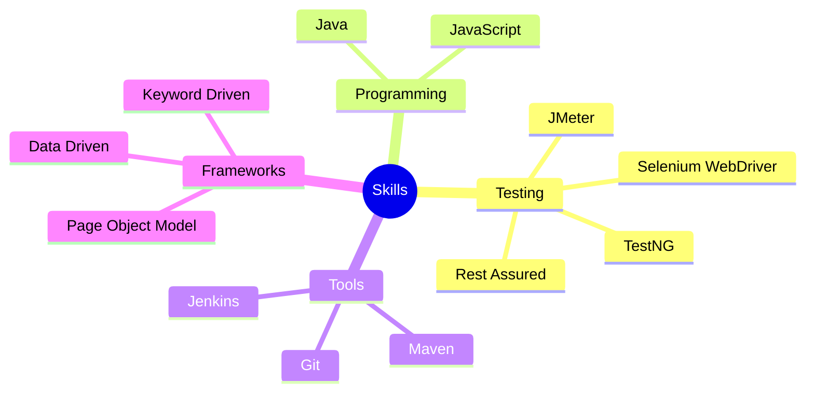

# 👋 Welcome to Anuradha's Tech Space

### Test Automation Engineer | Java Enthusiast

## 🚀 Featured Projects

### 🔹 Selenium Framework
- A robust and scalable test automation framework built with Selenium WebDriver
- Implements Page Object Model (POM) design pattern
- Integrated with TestNG for test execution and reporting
- Maven for dependency management

### 🔹 JMeter Training
- Comprehensive performance testing materials
- Load testing best practices
- Test script optimization guides
- Real-world testing scenarios

### 🔹 Rest Assured Training
- API testing fundamentals and advanced concepts
- Best practices for REST API automation
- Integration with CI/CD pipelines
- Extensive example test cases

## 💻 Technical Skills

## 🛠️ Technologies & Tools

## 📈 GitHub Stats

## 🤝 Let's Connect!

Feel free to reach out if you're interested in:
- 🤖 Test Automation
- 🌐 API Testing
- 📊 Performance Testing
- 👥 Collaboration on Testing Projects

### "Quality is not an act, it is a habit." - Aristotle

---
⭐️ From [Anuradha9099](https://github.com/Anuradha9099)
